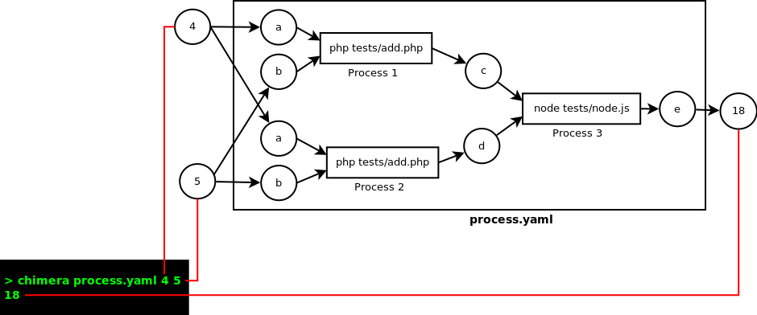

# Chimera-Framework

Chimera-framework is a language agnostic framework for standalone and distributed computing. Chimera-framework is written in Node.js. As a component based software engineering framework, Chimera-framework allows you to orchestrate several components to achieve a greater goal. Despite of written in `Node.JS`, Chimera-framework let you write your components in any languages (even executable machine language such as linux commands).

# Why Chimera-Framework?

* CLI Support

    Command Line Interface was there since the dawn of UNIX and still relevant today. There are a lot of powerful utilities run on CLI. In Chimera-Framework, you can use them as components of your program. Most programming language also support CLI. Perl, Python, PHP, Ruby, Haskell, Javascript, C, Java, Pascal, R, and even Matlab (see: [http://stackoverflow.com/questions/6657005/matlab-running-an-m-file-from-command-line](http://stackoverflow.com/questions/6657005/matlab-running-an-m-file-from-command-line)) are supporting CLI.

* Programming Language Diversity

    Some programming language are good at several cases, while some other are better at other cases. You might love PHP from the bottom of your heart. But when it come to statistic computation, R might be a better bet. By using Chimera, you can make PHP, R, and even CLI utilities work together.

* Less Painful Technology Migration

    New technologies raise, while some others fall. In the world of software development, limitting our knowledge to a single technology is the worst thing to do. Using Chimera-framework, it is possible to build small components that can be swapped or changed any time. Thus, you can replace some components rather than rebuild your system from scratch.

# Installation

Chimera-Framework installation is very easy. First, you need to have `Node.Js` and `npm` installed. Then you can simply perform

```sh
npm install --global chimera-framework
```

Another method to install Chimera-Framework is by using `git`. First, you should make sure you have `git` client installed.
```sh
git clone git@github.com:goFrendiAsgard/chimera.git
npm install
npm link
```

# Dependencies

* Node.Js
* npm
* Interpreters/Compilers, depend on programming language you use.

# Testing 

Chimera-Framework was built with TDD in mind. You can run the test by executing `npm test`. The test require `python`, `php`, and `java` to be already installed.

# Using Chimera-Framework 

To use Chimera-Framework, you need to define YAML chain file. Then you can invoke your process as follow:

```sh
chimera [your-chain-file.yaml] [input1 [input2 [input3 ...]]]
```

The complete YAML chain file semantic rule can be found [here](doc/doc.chain-semantic.md)

__Note:__ You can also use JSON Format instead of YAML.

## Basic Example

Suppose we have two simple programs in PHP and Javascript. The task is to perform `(a+b) + (a+b)`.
The task was broken down into several sub processes:

* Process 1 : c = a+b (written in PHP)
* Process 2 : d = a+b (written in PHP)
* Process 3 : e = c+d (written in Javascript)

Since Process 1 and process 2 are independent to each other, we would execute them in parallel.
On the other hand, process 3 depend on process 1 and process 2's output. Thus, we would execute process 3 after process 1 and process 2 completed.



To demonstrate language agnosticism, process 1 and process 2 was written in PHP (they have the same source code),while process 3 was written in Javascript. Each programs require two input arguments and return single output. The source code of process 1 and process 2 is presented below: 

```php
<?php
// File Location : tests/add.php
$n1 = $argv[1];
$n2 = $argv[2];
echo $n1 + $n2;
```

While the source code of process 3 is shown below: 

```Javascript
// File Location : tests/add.js
var n1 = parseInt(process.argv[2]) ;
var n2 = parseInt(process.argv[3]) ;
console.log n1 + n2;
```

In order to assemble the process, we need to build a YAML chain file.  The complete semantic rule of YAML chain is presented [here](doc/doc.chain-semantic.md)
```yaml
# file location process.yaml
ins: a,b
out: e
series:
  − parallel :
    # Process 1
    − (a,b) −> php tests/add.php −> c
    # Process 2
    − (a,b) −> php tests/add.php −> d
  # Process 3
  − (c,d) −> node tests/add.js −> e
```
The `Root Process` takes two input, (`a`, and `b`) and yield a single output `e`.

Process 1 and process 2 will be done in parallel.

Process 1 takes two inputs (`a` and `b`) and return `c` as output.

Process 2 takes two inputs (`a` and `b`) and return `d` as output.

After Process 1 and Process 2 finished, Process 3 will be executed. Process 3 takes `c` and `d` as output and return `e` as output.

To execute the process, we can invoke:

```sh
chimera process.yaml 4 5
```

The output should be `18` as `(4+5) + (4+5) = 18`.

## Advance Example

More advance example including:

* Distributed process
* Shorthand
* Process control (loop and branch)
* Nested variable
* Yaml string as argument 

are presented [here](doc/doc.advance-example.md)

# API 

Chimera provide several API:

* `executeChain`
* `getFormattedNanoSecond`
* `deepCopyObject`
* `patchObject`

The complete API list is presented [here](doc/doc.api.md)

# Utilities

* `chimera`
* `chimera-serve`
* `chimera-send`
* `chimera-eisn`
* `chimera-init-web`

The complete Utilities list is presented [here](doc/doc.utilities.md)

# Web Framework

Chimera web framework is still in development phase. The API might changed anytime.

For more information about the web framework, please visit [this](doc/doc.web-framework.md)

# Similar projects, inspirations, and how chimera-framework different from them

* Polyglot (https://github.com/sausheong/polyglot)

    In polyglot, single process flow is written in a single programming language. However, you can have a lot of process flows, which each of them can be written in different languages.

    In chimera-framework, singe process can be divided into several sub-processes. Every sub-process can be written in different language.

* Beaker notebook (http://beakernotebook.com/)

    This one is quite similar to chimera-framework. However, the main purpose of beaker is for prototyping and note-taking. In beaker a cell cannot be used in different notebook. You should copy the cell into another notebook in order to use the same piece of code.

* Invoker (http://dota2.gamepedia.com/Invoker)

    A hard-to-master DOTA hero. Not even a framework. Has cool abilities which are combination of 3 orbs.

* Chimera (https://en.wikipedia.org/wiki/Chimera_(mythology))

    Legendary creature. Combination of goat, lion, and snake.
